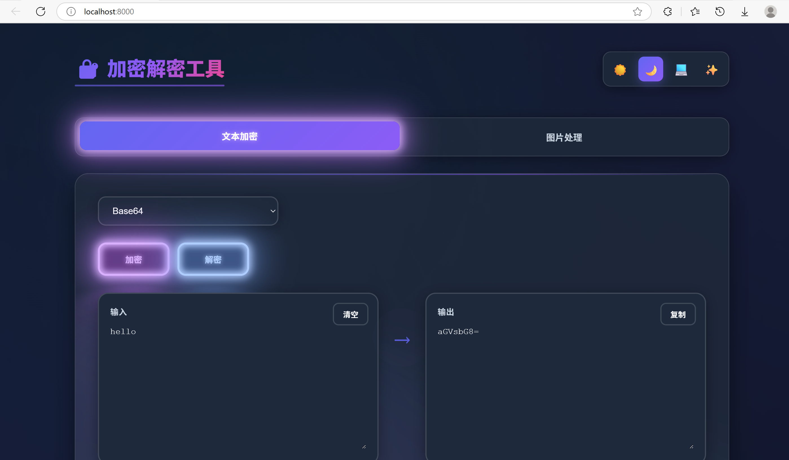

# 🔐 加密解密工具 / Encrypt-Decrypt Tool

 &lt;!-- 建议放一张界面截图 --&gt;

一个功能全面、界面精美的本地加密解密 Web 工具，支持多种文本编码方式以及图片与 Base64 互转。所有操作均在浏览器本地完成，无需服务器，保护隐私安全。

---

## ✨ 功能特性

### 文本加密 / 解密
- **Base64** 编码/解码
- **URL 编码**/解码
- **HTML 实体** 编码/解码
- **十六进制 (Hex)** 与文本互转
- **二进制** 与文本互转

### 图片处理
- **图片 → Base64**：将图片转换为 DataURL 格式的 Base64 字符串
- **Base64 → 图片**：将 Base64 字符串还原为图片并支持下载

### 界面与体验
- 🌓 **深色/浅色主题** 一键切换（支持跟随系统）
- ✨ **两种视觉模式**：有特效版（动画丰富、毛玻璃效果） / 无特效版（GPU 占用低，适合老旧设备）
- 💡 输入/输出区域支持清空、一键复制
- 📱 响应式设计，完美适配移动端

---

## 🚀 快速开始

### 方法一：使用 Python 启动本地服务器（推荐）
项目内置了快速启动脚本，会自动打开浏览器。
```bash
# 确保已安装 Python 3
# Windows 用户双击 `启动.bat` 即可
# 或在终端执行：
python 快速启动.py
```

### 方法二：直接打开 HTML 文件
由于浏览器安全限制（如跨域、剪贴板 API 限制），部分功能可能无法在 file:// 协议下正常工作，建议通过本地服务器运行。

---

## 🎨 特效与性能

首次打开时会弹出性能警告，您可以选择：

- **有特效版（style.css）**：包含丰富的 CSS 动画、毛玻璃效果、霓虹灯按钮等，视觉效果华丽，但会占用更多 GPU 资源。

- **无特效版（style-no-effects.css）**：移除了大部分动画和复杂滤镜，保留核心功能，适合低性能设备或偏好简洁的用户。

之后可通过右上角的 ✨ 按钮随时切换版本，选择会保存在本地存储中。

---

## 🛠️ 技术栈

- 纯原生 HTML5 / CSS3 / JavaScript（ES6+）
- 无任何第三方依赖
- 使用 FileReader、TextEncoder / TextDecoder、Clipboard API 等现代 Web API
- 启动脚本使用 Python 内置 HTTP 服务器

---

## 📁 项目结构

```text
.
├── index.html                # 主页面
├── style.css                 # 有特效版样式
├── style-no-effects.css      # 无特效版样式
├── script.js                 # 主逻辑（所有加密解密、图片处理功能）
├── 快速启动.py                # Python 启动脚本
├── 启动.bat                   # Windows 批处理启动文件
└── README.md                 # 说明文档
```

---

## ⚠️ 注意事项

- 所有数据均在本地处理，不会上传到任何服务器，请放心使用。
- 解码时请注意输入格式正确，否则会提示错误。
- 图片转 Base64 生成的字符串较长，复制时请耐心等待。
- 如果遇到性能问题，可以切换到无特效版。
- 首次打开时会弹出性能选择弹窗，选择后不会再次弹出，如需重新选择，可以清除浏览器本地存储。

---

## 🤝 贡献

欢迎提交 Issue 或 Pull Request 来改进这个项目！如果您有任何建议或发现了 Bug，请及时反馈。
